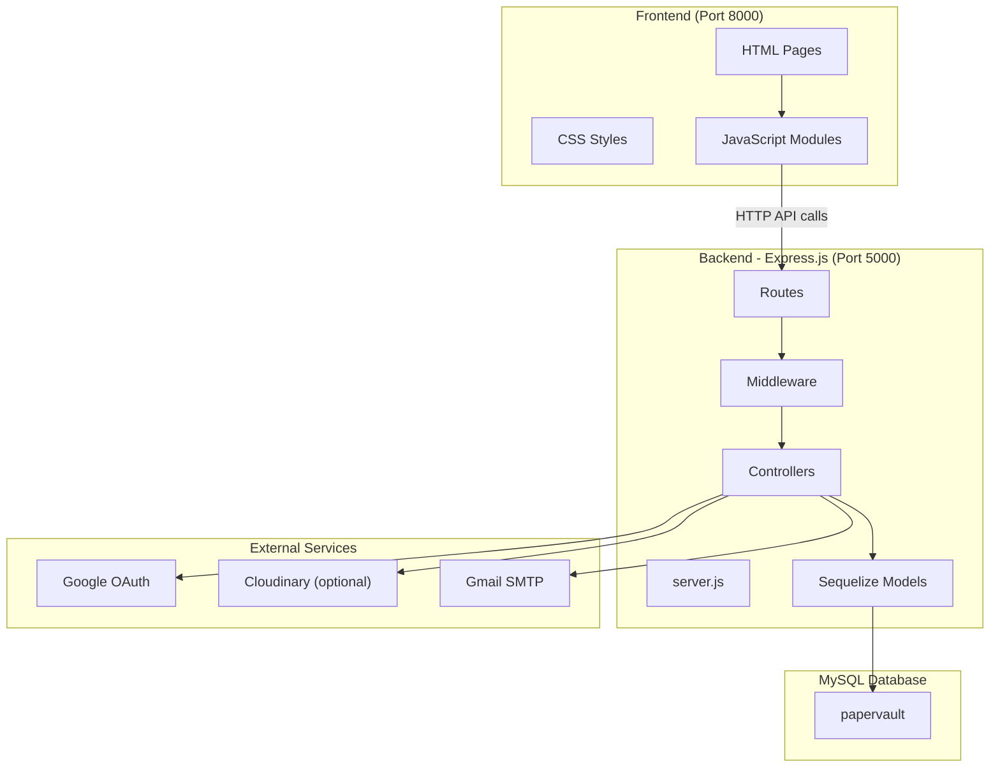
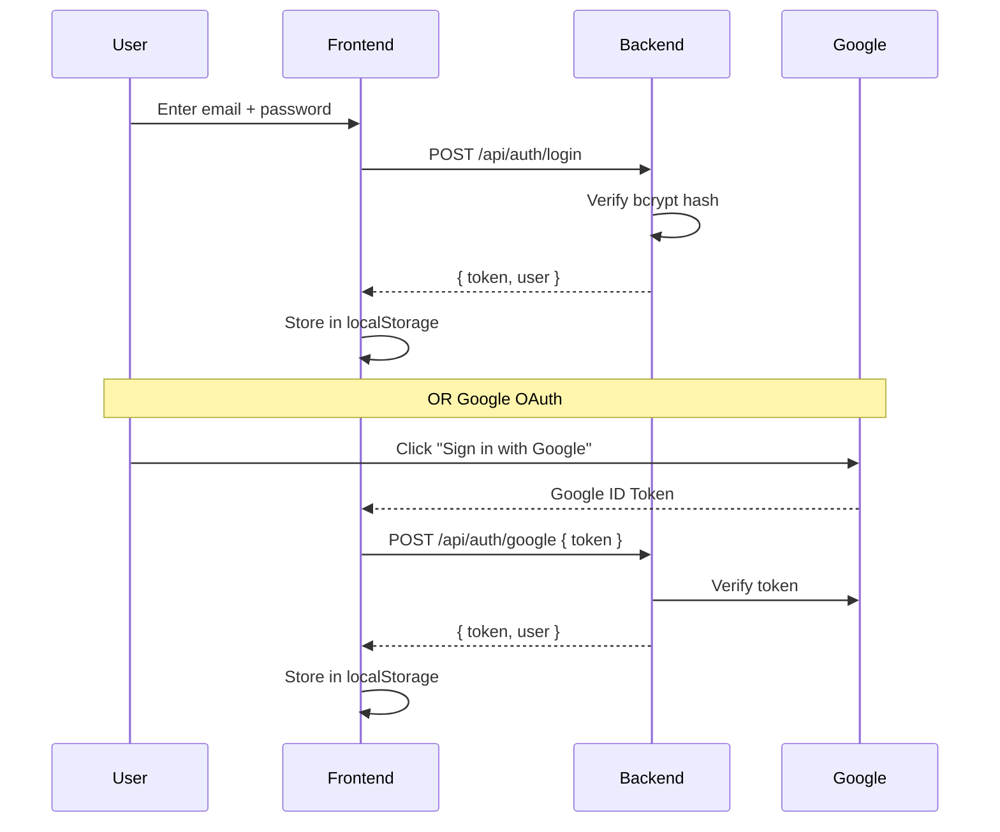
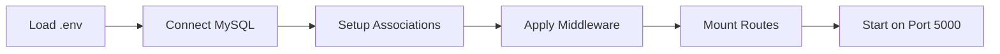
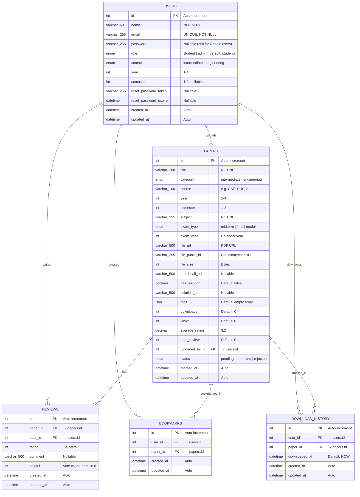
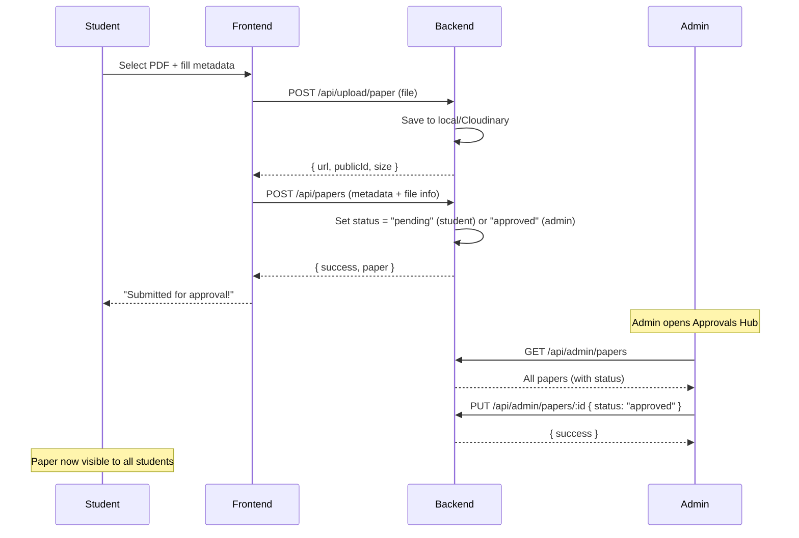

# 📚 PaperVault — Complete Project Documentation

> **PaperVault** is a full-stack web application for RGUKT students to upload, browse, bookmark, and download question papers. It features role-based access (Student & Admin), Google OAuth, and a paper approval workflow.

---

## 📐 Architecture Overview



---

# 🖥️ FRONTEND DOCUMENTATION

## Tech Stack
- **HTML5** — Page structure
- **Vanilla CSS** — Styling with [premium.css](file:///home/a-raghavendra/Desktop/WT_PROJECT/WT_Project/frontend/css/premium.css) design system
- **Vanilla JavaScript** — All logic (no React/Vue/Angular)
- **Bootstrap Icons** — Icon library
- **Google Fonts** — Outfit, Inter, Syne, DM Sans

## File Structure

```
frontend/
├── index.html                      ← Landing/home page
├── login.html                      ← Login page (email + Google OAuth)
├── register.html                   ← Registration redirect
├── forgot-password.html            ← Password reset request
├── about.html                      ← About page
├── contact.html                    ← Contact form
│
├── question-papers-dashboard.html  ← Main student dashboard (browse papers)
├── upload-paper.html               ← Upload a question paper (any logged-in user)
├── bookmarks.html                  ← Saved/bookmarked papers
├── my-downloads.html               ← Download history
├── my-profile.html                 ← User profile page
├── settings.html                   ← User settings
├── view-history.html               ← Recently viewed papers
│
├── admin-dashboard.html            ← Admin: System overview with stats
├── admin-approvals.html            ← Admin: Approve/reject pending papers
├── admin-users.html                ← Admin: Manage users & roles
│
├── css/
│   ├── premium.css                 ← Global design system (sidebar, nav, layout)
│   └── styles.css                  ← Additional styles
│
├── js/
│   ├── config.js                   ← API base URL, storage keys, constants
│   ├── api.js                      ← API service (fetch wrapper, auth, papers, users)
│   ├── auth.js                     ← Auth helpers (protectPage, showToast, etc.)
│   ├── login.js                    ← Login page logic
│   ├── register.js                 ← Registration page logic
│   ├── home.js                     ← Landing page logic
│   ├── papers.js                   ← Paper browsing logic
│   ├── paper-detail.js             ← Single paper view logic
│   ├── contact.js                  ← Contact form logic
│   ├── forgot-password.js          ← Password reset logic
│   │
│   └── admin/
│       ├── dashboard.js            ← Admin dashboard logic (legacy, unused)
│       ├── approvals.js            ← Admin approvals logic (legacy, unused)
│       ├── users.js                ← Admin users logic (legacy, unused)
│       ├── upload.js               ← Admin upload logic
│       ├── papers.js               ← Admin papers management
│       └── role-nav.js             ← Role-based sidebar visibility
│
└── papers/                         ← Local paper PDF storage
    └── uploads/                    ← Auto-created when uploading locally
```

> [!NOTE]
> The three admin HTML pages ([admin-dashboard.html](file:///home/a-raghavendra/Desktop/WT_PROJECT/WT_Project/frontend/admin-dashboard.html), [admin-approvals.html](file:///home/a-raghavendra/Desktop/WT_PROJECT/WT_Project/frontend/admin-approvals.html), [admin-users.html](file:///home/a-raghavendra/Desktop/WT_PROJECT/WT_Project/frontend/admin-users.html)) now contain **inline scripts** that directly call the API. The corresponding files in [js/admin/](file:///home/a-raghavendra/Desktop/WT_PROJECT/WT_Project/frontend/js/admin) (dashboard.js, approvals.js, users.js) are legacy and not currently loaded by the HTML pages.

## Key JavaScript Modules

### [config.js](file:///home/a-raghavendra/Desktop/WT_PROJECT/WT_Project/frontend/js/config.js) — Global Configuration
```javascript
CONFIG = {
    API_URL: 'http://localhost:5000/api',   // Backend API base
    STORAGE_KEYS: { TOKEN, USER, THEME },   // localStorage keys
    ITEMS_PER_PAGE: 12,
    MAX_FILE_SIZE: 10MB,
    TOAST_DURATION: 3000
}
```

### [api.js](file:///home/a-raghavendra/Desktop/WT_PROJECT/WT_Project/frontend/js/api.js) — API Services
Contains 4 service objects:

| Service | Methods | Description |
|---------|---------|-------------|
| `API` | [get()](file:///home/a-raghavendra/Desktop/WT_PROJECT/WT_Project/frontend/js/api.js#53-57), [post()](file:///home/a-raghavendra/Desktop/WT_PROJECT/WT_Project/frontend/js/api.js#58-65), [put()](file:///home/a-raghavendra/Desktop/WT_PROJECT/WT_Project/frontend/js/api.js#66-73), [delete()](file:///home/a-raghavendra/Desktop/WT_PROJECT/WT_Project/frontend/js/api.js#74-78), [uploadFile()](file:///home/a-raghavendra/Desktop/WT_PROJECT/WT_Project/frontend/js/api.js#79-110) | Low-level HTTP wrapper with JWT auth headers |
| `AuthService` | [login()](file:///home/a-raghavendra/Desktop/WT_PROJECT/WT_Project/frontend/js/api.js#121-130), [register()](file:///home/a-raghavendra/Desktop/WT_PROJECT/WT_Project/server/controllers/authController.js#8-46), [logout()](file:///home/a-raghavendra/Desktop/WT_PROJECT/WT_Project/frontend/upload-paper.html#725-730), [getMe()](file:///home/a-raghavendra/Desktop/WT_PROJECT/WT_Project/server/controllers/authController.js#157-172), [isLoggedIn()](file:///home/a-raghavendra/Desktop/WT_PROJECT/WT_Project/frontend/js/api.js#153-157), [isAdmin()](file:///home/a-raghavendra/Desktop/WT_PROJECT/WT_Project/frontend/js/api.js#164-169), [getCurrentUser()](file:///home/a-raghavendra/Desktop/WT_PROJECT/WT_Project/frontend/js/api.js#158-163) | Authentication management |
| `PaperService` | [getPapers()](file:///home/a-raghavendra/Desktop/WT_PROJECT/WT_Project/frontend/js/api.js#175-180), [getPaper()](file:///home/a-raghavendra/Desktop/WT_PROJECT/WT_Project/frontend/js/api.js#181-185), [createPaper()](file:///home/a-raghavendra/Desktop/WT_PROJECT/WT_Project/frontend/js/api.js#186-190), [updatePaper()](file:///home/a-raghavendra/Desktop/WT_PROJECT/WT_Project/server/controllers/paperController.js#182-206), [deletePaper()](file:///home/a-raghavendra/Desktop/WT_PROJECT/WT_Project/frontend/js/api.js#196-200), [downloadPaper()](file:///home/a-raghavendra/Desktop/WT_PROJECT/WT_Project/server/controllers/paperController.js#240-274) | Paper CRUD operations |
| `UserService` | [getProfile()](file:///home/a-raghavendra/Desktop/WT_PROJECT/WT_Project/frontend/js/api.js#216-220), [updateProfile()](file:///home/a-raghavendra/Desktop/WT_PROJECT/WT_Project/frontend/js/api.js#221-225), [getBookmarks()](file:///home/a-raghavendra/Desktop/WT_PROJECT/WT_Project/frontend/js/api.js#226-230), [addBookmark()](file:///home/a-raghavendra/Desktop/WT_PROJECT/WT_Project/frontend/js/api.js#231-235), [removeBookmark()](file:///home/a-raghavendra/Desktop/WT_PROJECT/WT_Project/frontend/js/api.js#236-240), [getDownloadHistory()](file:///home/a-raghavendra/Desktop/WT_PROJECT/WT_Project/frontend/js/api.js#241-245) | User operations |

### [auth.js](file:///home/a-raghavendra/Desktop/WT_PROJECT/WT_Project/frontend/js/auth.js) — Auth UI Helpers
| Function | Description |
|----------|-------------|
| [checkAuth()](file:///home/a-raghavendra/Desktop/WT_PROJECT/WT_Project/frontend/js/auth.js#5-32) | Updates navbar based on login state |
| [protectPage()](file:///home/a-raghavendra/Desktop/WT_PROJECT/WT_Project/frontend/js/auth.js#44-52) | Redirects unauthenticated users to login |
| [protectAdminPage()](file:///home/a-raghavendra/Desktop/WT_PROJECT/WT_Project/frontend/js/auth.js#53-65) | Redirects non-admin users |
| [showToast(message, type)](file:///home/a-raghavendra/Desktop/WT_PROJECT/WT_Project/frontend/js/auth.js#80-125) | Displays Bootstrap toast notification |
| [truncateText(text, max)](file:///home/a-raghavendra/Desktop/WT_PROJECT/WT_Project/frontend/js/auth.js#132-137) | Truncates long text with ellipsis |

## Page Details

### Public Pages
| Page | URL | Description |
|------|-----|-------------|
| Home | [/index.html](file:///home/a-raghavendra/Desktop/WT_PROJECT/WT_Project/frontend/index.html) | Landing page with hero, features, how-it-works |
| Login | [/login.html](file:///home/a-raghavendra/Desktop/WT_PROJECT/WT_Project/frontend/login.html) | Email/password + Google OAuth login |
| About | [/about.html](file:///home/a-raghavendra/Desktop/WT_PROJECT/WT_Project/frontend/about.html) | About PaperVault |
| Contact | [/contact.html](file:///home/a-raghavendra/Desktop/WT_PROJECT/WT_Project/frontend/contact.html) | Contact form |

### Student Pages (Login Required)
| Page | URL | Description |
|------|-----|-------------|
| Dashboard | [/question-papers-dashboard.html](file:///home/a-raghavendra/Desktop/WT_PROJECT/WT_Project/frontend/question-papers-dashboard.html) | Browse papers with filters (category, year, semester, exam type) |
| Upload | [/upload-paper.html](file:///home/a-raghavendra/Desktop/WT_PROJECT/WT_Project/frontend/upload-paper.html) | Drag-and-drop PDF upload with metadata form |
| Bookmarks | [/bookmarks.html](file:///home/a-raghavendra/Desktop/WT_PROJECT/WT_Project/frontend/bookmarks.html) | User's saved papers |
| Downloads | [/my-downloads.html](file:///home/a-raghavendra/Desktop/WT_PROJECT/WT_Project/frontend/my-downloads.html) | Download history |
| Profile | [/my-profile.html](file:///home/a-raghavendra/Desktop/WT_PROJECT/WT_Project/frontend/my-profile.html) | View/edit profile |
| Settings | [/settings.html](file:///home/a-raghavendra/Desktop/WT_PROJECT/WT_Project/frontend/settings.html) | App settings |
| History | [/view-history.html](file:///home/a-raghavendra/Desktop/WT_PROJECT/WT_Project/frontend/view-history.html) | Recently viewed papers |

### Admin Pages (Admin Role Required)
| Page | URL | Features |
|------|-----|----------|
| System Overview | [/admin-dashboard.html](file:///home/a-raghavendra/Desktop/WT_PROJECT/WT_Project/frontend/admin-dashboard.html) | Live stats (users, papers, downloads, today's papers), recent papers list, recent users list |
| Approvals Hub | [/admin-approvals.html](file:///home/a-raghavendra/Desktop/WT_PROJECT/WT_Project/frontend/admin-approvals.html) | Filter by status (Pending/All/Approved/Rejected), approve, reject, or delete papers |
| User Management | [/admin-users.html](file:///home/a-raghavendra/Desktop/WT_PROJECT/WT_Project/frontend/admin-users.html) | Search users, promote to admin, demote to student, delete users, pagination |

## Authentication Flow



---

# ⚙️ BACKEND DOCUMENTATION

## Tech Stack
- **Node.js** + **Express.js** — HTTP Server
- **Sequelize ORM** — MySQL query builder
- **MySQL** — Relational database
- **JWT** — Authentication tokens
- **bcryptjs** — Password hashing
- **multer** — File upload handling
- **Cloudinary** — Cloud file storage (optional, falls back to local)
- **nodemailer** — Email sending (password reset)
- **helmet** — Security headers
- **cors** — Cross-origin requests
- **compression** — Response compression
- **morgan** — HTTP request logging

## File Structure

```
server/
├── server.js                ← Entry point: Express app setup, middleware, routes
├── package.json             ← Dependencies and scripts
├── .env                     ← Environment variables (secrets)
├── .env.example             ← Template for .env
├── database_setup.sql       ← MySQL database creation script
│
├── config/
│   ├── db.js                ← Sequelize connection + sync
│   └── cloudinary.js        ← Cloudinary SDK configuration
│
├── models/
│   ├── User.js              ← User model (auth, roles)
│   ├── Paper.js             ← Paper model (question papers)
│   ├── Review.js            ← Review model (ratings + comments)
│   ├── Bookmark.js          ← Bookmark model (saved papers)
│   ├── DownloadHistory.js   ← Download tracking model
│   └── associations.js      ← All relationship definitions
│
├── controllers/
│   ├── authController.js    ← Auth logic (register, login, Google, password reset)
│   └── paperController.js   ← Paper CRUD logic
│
├── routes/
│   ├── auth.js              ← /api/auth/* routes
│   ├── papers.js            ← /api/papers/* routes
│   ├── users.js             ← /api/users/* routes (profile, bookmarks, downloads)
│   ├── admin.js             ← /api/admin/* routes (stats, users, papers management)
│   └── upload.js            ← /api/upload/* routes (file upload)
│
├── middleware/
│   ├── auth.js              ← JWT verification + role authorization
│   ├── errorHandler.js      ← Global error handler
│   └── upload.js            ← Multer file upload config (PDF only, 10MB max)
│
├── seeds/
│   ├── createAdmin.js       ← Creates admin user (admin@papervault.com / admin123)
│   └── samplePapers.js      ← Seeds sample paper data
│
├── utils/
│   └── sendEmail.js         ← Nodemailer email utility
│
└── uploads/                 ← Temporary file upload directory (multer)
```

## Server Entry Point — [server.js](file:///home/a-raghavendra/Desktop/WT_PROJECT/WT_Project/server/server.js)



**Middleware chain** (in order):
1. `helmet` — Security headers (with `same-origin-allow-popups` for Google OAuth)
2. `compression` — Gzip response compression
3. `cors` — Allow localhost:3000, 5000, 8000
4. `express.json()` — Parse JSON request bodies
5. `express.urlencoded()` — Parse form data
6. `morgan('dev')` — Request logging

## Complete API Reference

### 🔐 Auth Routes (`/api/auth`)

| Method | Endpoint | Access | Description |
|--------|----------|--------|-------------|
| `POST` | `/register` | Public | Register a new user |
| `POST` | `/login` | Public | Login with email & password |
| `POST` | `/google` | Public | Login/register via Google OAuth |
| `GET` | `/me` | Private | Get current user profile |
| `POST` | `/forgotpassword` | Public | Send password reset email |
| `PUT` | `/resetpassword/:token` | Public | Reset password with token |
| `POST` | `/logout` | Private | Logout user |

**Register Request:**
```json
POST /api/auth/register
{
    "name": "John Doe",
    "email": "john@example.com",
    "password": "password123",
    "course": "engineering",
    "year": 2,
    "semester": 1
}
```

**Login Response:**
```json
{
    "success": true,
    "token": "eyJhbGciOiJIUzI1NiIs...",
    "user": {
        "id": 1,
        "name": "John Doe",
        "email": "john@example.com",
        "role": "student",
        "course": "engineering",
        "year": 2
    }
}
```

### 📄 Paper Routes (`/api/papers`)

| Method | Endpoint | Access | Description |
|--------|----------|--------|-------------|
| `GET` | `/` | Public | Get all approved papers (with filters & pagination) |
| `POST` | `/` | Private | Create a new paper record |
| `GET` | `/pending` | Admin | Get all pending papers |
| `GET` | [/:id](file:///home/a-raghavendra/Desktop/WT_PROJECT/WT_Project/frontend/js/admin/upload.js#93-96) | Public | Get single paper (auto-increments views) |
| `PUT` | [/:id](file:///home/a-raghavendra/Desktop/WT_PROJECT/WT_Project/frontend/js/admin/upload.js#93-96) | Admin | Update paper |
| `PUT` | `/:id/approve` | Admin | Approve a paper |
| `DELETE` | [/:id](file:///home/a-raghavendra/Desktop/WT_PROJECT/WT_Project/frontend/js/admin/upload.js#93-96) | Admin | Delete paper |
| `GET` | `/:id/download` | Public | Download paper (increments download count) |

**Query Filters for `GET /api/papers`:**
| Param | Example | Description |
|-------|---------|-------------|
| `category` | `engineering` | Filter by category |
| `year` | `2` | Filter by academic year |
| `semester` | `1` | Filter by semester |
| `subject` | `Mathematics` | Filter by subject (partial match) |
| `examType` | `midterm` | Filter by exam type |
| [search](file:///home/a-raghavendra/Desktop/WT_PROJECT/WT_Project/frontend/admin-users.html#535-547) | `calculus` | Search in title & subject |
| `sort` | `-downloads` | Sort field (prefix `-` for DESC) |
| `page` | `1` | Page number |
| `limit` | `12` | Items per page |

### 📤 Upload Routes (`/api/upload`)

| Method | Endpoint | Access | Description |
|--------|----------|--------|-------------|
| `POST` | `/paper` | Private | Upload a PDF (auto-detects local vs Cloudinary) |
| `POST` | `/solution` | Private | Upload a solution PDF |

> [!IMPORTANT]
> When `CLOUDINARY_API_KEY` is set to `your_api_key` (default placeholder), uploads are saved **locally** to `frontend/papers/uploads/`. When configured with real Cloudinary credentials, files are uploaded to the cloud.

### 👤 User Routes (`/api/users`) — All Private

| Method | Endpoint | Description |
|--------|----------|-------------|
| `GET` | `/profile` | Get user profile |
| `PUT` | `/profile` | Update profile (name, email, course, year, semester) |
| `GET` | `/bookmarks` | Get bookmarked papers |
| `POST` | `/bookmarks/:paperId` | Add bookmark |
| `DELETE` | `/bookmarks/:paperId` | Remove bookmark |
| `PUT` | `/bookmarks/:paperId` | Toggle bookmark (add/remove) |
| `GET` | `/bookmarks/:paperId/check` | Check if paper is bookmarked |
| `GET` | `/downloads` | Get download history |
| `POST` | `/downloads/:paperId` | Record a download |
| `GET` | `/stats` | Get user stats (bookmark count, download count) |

### 🛡️ Admin Routes (`/api/admin`) — Admin Only

| Method | Endpoint | Description |
|--------|----------|-------------|
| `GET` | `/stats` | Dashboard stats (total users, papers, downloads, today's papers, breakdowns) |
| `GET` | `/users` | List all users (paginated) |
| `GET` | `/users/:id` | Get single user |
| `PUT` | `/users/:id` | Update user role |
| `DELETE` | `/users/:id` | Delete user (can't delete self) |
| `GET` | `/papers` | List all papers (all statuses, paginated) |
| `PUT` | `/papers/:id` | Update paper status (approve/reject) |
| `DELETE` | `/papers/:id` | Delete paper permanently |
| `GET` | `/activity` | Recent activity (downloads, reviews, users) |

## Middleware Details

### [auth.js](file:///home/a-raghavendra/Desktop/WT_PROJECT/WT_Project/server/middleware/auth.js) — Authentication

| Function | Description |
|----------|-------------|
| `protect` | Extracts JWT from `Authorization: Bearer <token>` header, verifies it, and attaches `req.user` |
| `authorize(...roles)` | Checks if `req.user.role` is in the allowed roles list |

### [upload.js](file:///home/a-raghavendra/Desktop/WT_PROJECT/WT_Project/server/middleware/upload.js) — File Upload
- **Storage**: `multer.diskStorage` → saves to `server/uploads/` temporarily
- **File filter**: PDF only (`application/pdf`)
- **Size limit**: 10MB max

### [errorHandler.js](file:///home/a-raghavendra/Desktop/WT_PROJECT/WT_Project/server/middleware/errorHandler.js) — Error Handler
- Catches all errors from routes/controllers
- Returns standardized `{ success: false, message, stack? }` response
- Shows stack trace only in development mode

## NPM Scripts

```bash
npm run dev          # Start with nodemon (auto-restart on changes)
npm start            # Start production server
npm run seed:admin   # Create admin user
npm run seed:papers  # Insert sample papers
npm run seed:all     # Run both seeds
```

---

# 🗄️ DATABASE DOCUMENTATION

## Connection Details
| Property | Value |
|----------|-------|
| **Engine** | MySQL |
| **Host** | localhost |
| **Port** | 3306 |
| **Database** | `papervault` |
| **User** | `papervault_user` |
| **Password** | `papervault123` |
| **ORM** | Sequelize (auto-sync on startup) |

## Entity-Relationship Diagram



## Table Details

### 1. `users` — [User.js](file:///home/a-raghavendra/Desktop/WT_PROJECT/WT_Project/server/models/User.js)

| Column | Type | Constraints | Description |
|--------|------|-------------|-------------|
| `id` | INT | PK, Auto-increment | Unique user ID |
| `name` | VARCHAR(50) | NOT NULL | Display name |
| `email` | VARCHAR(255) | NOT NULL, UNIQUE | Login email (auto-lowercased via setter) |
| `password` | VARCHAR(255) | Nullable | Bcrypt hash (null for Google OAuth users) |
| `role` | ENUM | Default: `student` | `student` or `admin` |
| `course` | ENUM | NOT NULL | `intermediate` or `engineering` |
| `year` | INT | NOT NULL, 1-4 | Academic year |
| `semester` | INT | Nullable, 1-2 | Semester number |
| `reset_password_token` | VARCHAR(255) | Nullable | SHA-256 hash of reset token |
| `reset_password_expire` | DATETIME | Nullable | Token expiry (10 minutes) |

**Special behaviors:**
- Password is **auto-hashed** with bcrypt (salt rounds: 10) before `create` and `update` via hooks
- Password is **excluded by default** from queries (`defaultScope`). Use `User.scope('withPassword')` to include it
- Instance methods: `matchPassword()`, `getSignedJwtToken()`, `getResetPasswordToken()`

### 2. `papers` — [Paper.js](file:///home/a-raghavendra/Desktop/WT_PROJECT/WT_Project/server/models/Paper.js)

| Column | Type | Constraints | Description |
|--------|------|-------------|-------------|
| `id` | INT | PK, Auto-increment | Unique paper ID |
| `title` | VARCHAR(200) | NOT NULL | Paper title |
| `category` | ENUM | NOT NULL | `intermediate` or `engineering` |
| `course` | VARCHAR(100) | NOT NULL | Branch/course (CSE, ECE, PUC-2, etc.) |
| `year` | INT | NOT NULL, 1-4 | Academic year |
| `semester` | INT | NOT NULL, 1-2 | Semester |
| `subject` | VARCHAR(255) | NOT NULL | Subject name |
| `exam_type` | ENUM | NOT NULL | `midterm`, `final`, or `model` |
| `exam_year` | INT | NOT NULL | Calendar year of the exam |
| `file_url` | VARCHAR(500) | NOT NULL | URL to the PDF file |
| `file_public_id` | VARCHAR(255) | NOT NULL | Cloudinary public ID or local identifier |
| `file_size` | INT | NOT NULL | File size in bytes |
| `thumbnail_url` | VARCHAR(500) | Nullable | Preview image |
| `has_solution` | BOOLEAN | Default: false | Whether solution exists |
| `solution_url` | VARCHAR(500) | Nullable | Solution file URL |
| `tags` | JSON | Default: [] | Searchable tags array |
| `downloads` | INT | Default: 0 | Total download count |
| `views` | INT | Default: 0 | Total view count |
| `average_rating` | DECIMAL(3,2) | Default: 0.00 | Average review rating |
| `num_reviews` | INT | Default: 0 | Total review count |
| `uploaded_by_id` | INT | FK → users.id | Who uploaded the paper |
| `status` | ENUM | Default: `pending` | `pending`, `approved`, or `rejected` |

**Indexes:**
- Composite: `(category, year, semester)`
- Single: `subject`, `exam_type`
- Fulltext: `(title, subject)`

**Instance methods:** `incrementDownloads()`, `incrementViews()`

### 3. `reviews` — [Review.js](file:///home/a-raghavendra/Desktop/WT_PROJECT/WT_Project/server/models/Review.js)

| Column | Type | Constraints | Description |
|--------|------|-------------|-------------|
| `id` | INT | PK | Review ID |
| `paper_id` | INT | FK → papers.id | Paper being reviewed |
| `user_id` | INT | FK → users.id | Reviewer |
| `rating` | INT | NOT NULL, 1-5 | Star rating |
| `comment` | VARCHAR(500) | Nullable | Text comment |
| `helpful` | INT | Default: 0 | "Helpful" vote count |

**Unique constraint:** `(paper_id, user_id)` — one review per user per paper

**Auto-hooks:** After create/update/destroy, automatically recalculates `papers.average_rating` and `papers.num_reviews`

### 4. `bookmarks` — [Bookmark.js](file:///home/a-raghavendra/Desktop/WT_PROJECT/WT_Project/server/models/Bookmark.js)

| Column | Type | Constraints | Description |
|--------|------|-------------|-------------|
| `id` | INT | PK | Bookmark ID |
| `user_id` | INT | FK → users.id | User |
| `paper_id` | INT | FK → papers.id | Paper |

**Unique constraint:** `(user_id, paper_id)` — can't bookmark same paper twice

### 5. `download_history` — [DownloadHistory.js](file:///home/a-raghavendra/Desktop/WT_PROJECT/WT_Project/server/models/DownloadHistory.js)

| Column | Type | Constraints | Description |
|--------|------|-------------|-------------|
| `id` | INT | PK | Record ID |
| `user_id` | INT | FK → users.id | Downloader |
| `paper_id` | INT | FK → papers.id | Downloaded paper |
| `downloaded_at` | DATETIME | Default: NOW | Timestamp |

## Relationships — [associations.js](file:///home/a-raghavendra/Desktop/WT_PROJECT/WT_Project/server/models/associations.js)

| Relationship | Type | Alias | Foreign Key |
|---|---|---|---|
| User → Paper | One-to-Many | `uploadedPapers` / `uploadedBy` | `uploaded_by_id` |
| User → Review | One-to-Many | `reviews` / `user` | `user_id` |
| Paper → Review | One-to-Many | `reviews` / `paper` | `paper_id` |
| User ↔ Paper (Bookmarks) | Many-to-Many | `bookmarkedPapers` / `bookmarkedBy` | via `bookmarks` table |
| User → DownloadHistory | One-to-Many | `downloadHistory` / `user` | `user_id` |
| Paper → DownloadHistory | One-to-Many | `paperDownloads` / `paper` | `paper_id` |

---

# 🚀 HOW TO RUN

### Prerequisites
- **Node.js** (v16+)
- **MySQL** (v8+)
- **npm**

### Step 1: Setup Database
```bash
mysql -u root -p
```
```sql
CREATE DATABASE IF NOT EXISTS papervault CHARACTER SET utf8mb4 COLLATE utf8mb4_unicode_ci;
CREATE USER 'papervault_user'@'localhost' IDENTIFIED BY 'papervault123';
GRANT ALL PRIVILEGES ON papervault.* TO 'papervault_user'@'localhost';
FLUSH PRIVILEGES;
```

### Step 2: Install Dependencies
```bash
cd server
npm install
```

### Step 3: Configure Environment
Copy `.env.example` to `.env` and fill in the values (or use the defaults).

### Step 4: Seed Data
```bash
npm run seed:admin    # Creates admin@papervault.com / admin123
npm run seed:papers   # Adds sample papers
```

### Step 5: Start Servers
```bash
# Terminal 1 — Backend
cd server
npm run dev           # Runs on http://localhost:5000

# Terminal 2 — Frontend
cd frontend
python3 -m http.server 8000    # Runs on http://localhost:8000
```

### Step 6: Access
- **Frontend**: http://localhost:8000
- **API**: http://localhost:5000/api/health
- **Admin Login**: `admin@papervault.com` / `admin123`

---

# 🔧 Environment Variables

| Variable | Default | Description |
|----------|---------|-------------|
| `NODE_ENV` | `development` | Environment mode |
| `PORT` | `5000` | Server port |
| `CLIENT_URL` | `http://localhost:3000` | Frontend URL for CORS |
| `DB_HOST` | `localhost` | MySQL host |
| `DB_PORT` | `3306` | MySQL port |
| `DB_NAME` | `papervault` | Database name |
| `DB_USER` | `papervault_user` | MySQL username |
| `DB_PASSWORD` | `papervault123` | MySQL password |
| `JWT_SECRET` | (set in .env) | JWT signing secret |
| `JWT_EXPIRE` | `30d` | Token expiry |
| `GOOGLE_CLIENT_ID` | (set in .env) | Google OAuth Client ID |
| `CLOUDINARY_CLOUD_NAME` | `your_cloud_name` | Cloudinary config (optional) |
| `CLOUDINARY_API_KEY` | `your_api_key` | Cloudinary config (optional) |
| `CLOUDINARY_API_SECRET` | `your_api_secret` | Cloudinary config (optional) |
| `EMAIL_HOST` | `smtp.gmail.com` | SMTP host for emails |
| `EMAIL_PORT` | `587` | SMTP port |
| `EMAIL_USER` | (set in .env) | Gmail address |
| `EMAIL_PASSWORD` | (set in .env) | Gmail app password |

> [!TIP]
> If Cloudinary is not configured (`CLOUDINARY_API_KEY` is `your_api_key`), file uploads automatically fall back to **local storage** at `frontend/papers/uploads/`.

---

# 📋 Paper Upload & Approval Workflow


